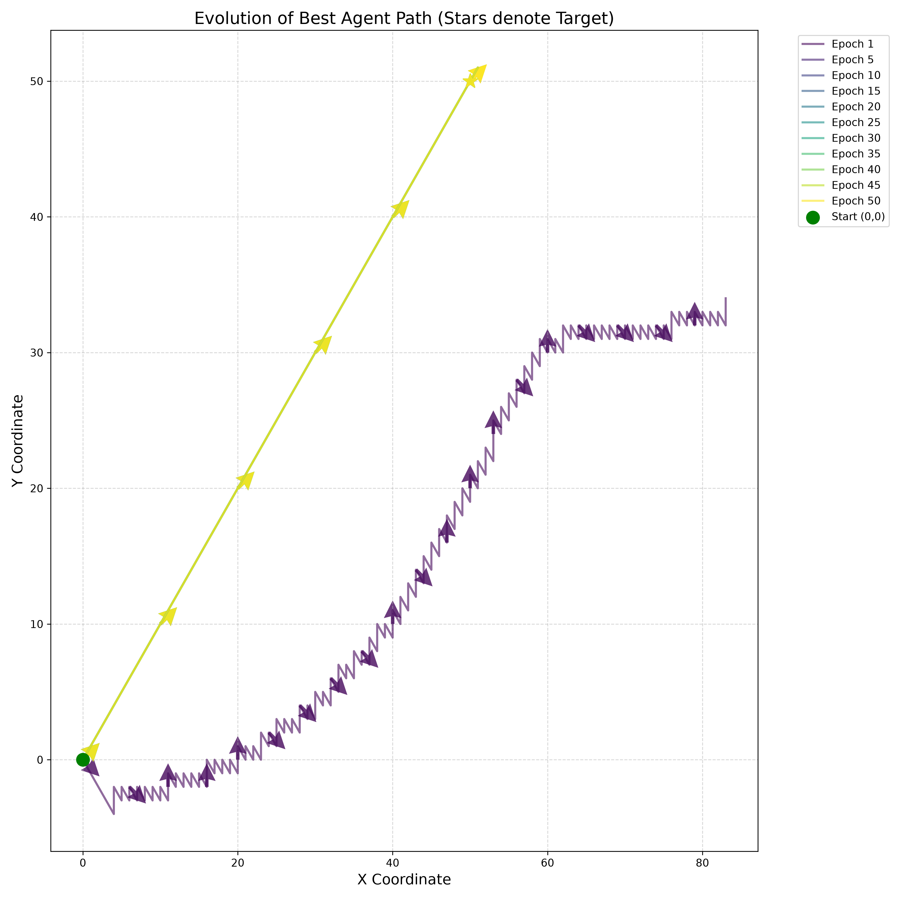
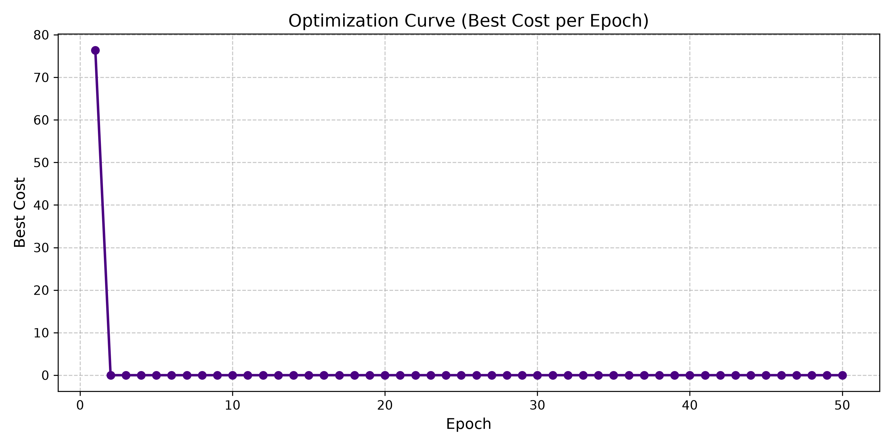

# Dynamic Field Learning Systems (DFLS) (v1.0 Prototype)

[](https://java.com/)
[](https://python.org/)
[](#)

A high-performance physics simulation and pathfinding engine that uses Machine Learning to teach agents how to navigate complex environments.

Instead of hardcoding rules for how agents should move, this engine allows agents to "learn" the best paths over time. By evaluating their surroundings (like the distance to a goal or avoiding obstacles) and repeatedly simulating their movements across multiple epochs, the agents evolve to find the mathematically optimal route to their targets.

While this v1.0 Prototype demonstrates 2D pathfinding (agents seeking a target coordinate), the core engine is completely generic. It can be adapted for any continuous planning, routing, or model-based reinforcement learning problem where an entity needs to figure out the best sequence of actions to achieve a goal.

*(Under the hood, it achieves blazing fast speeds by flattening all data into simple contiguous arrays, bypassing traditional object-oriented overhead. This makes it capable of simulating hundreds of thousands of agents in real-time).*

---

## 🎯 Demo & Evidence

When hooked up to the internal `EvolutionaryOptimizer`, a batch of 100 random agents quickly converges on the optimal path to a designated goal state across 50 epochs. 

*Below: The trajectory of the best agent over 50 epochs. Note how the agent quickly evolves from erratic guessing to a mathematically optimal straight line to the target (the star).*



*The cost function strictly minimizing to zero over the course of the training epochs.*



---

## 🏗️ How It Works

The system is broken down into three main pieces:

1. **Simulation Engine (Java)**: The ultra-fast core that moves the agents around the world.
2. **Machine Learning Optimizer (Java)**: The "brain" that evaluates how well the agents did and evolves them to be smarter in the next round.
3. **Visualizer (Python)**: Reads the simulation data and draws the graphs and paths.

### The Simulation Loop

Every "tick" of the simulation, the `World` orchestrator guides the agents through four intuitive steps:

1. **State Space**: Where is the agent right now? (e.g., its X, Y coordinates).
2. **Topology**: Where can the agent move next? (e.g., up, down, left, right, or diagonal).
3. **Field Generator**: What is the environment like around those possible next steps? (e.g., is one step closer to the target? Is one step closer to a danger zone?).
4. **Agent Transition**: Based on what it has learned, the agent looks at the surrounding environment and decides which step to take.

By repeating this loop, agents navigate their world step-by-step. After a full simulation run, the ML Optimizer steps in to tweak how the agents evaluate their environments, making them better and faster for the next run.

---

## 💻 Code Example

Setting up and running the simulation requires composing the rules and firing the batch orchestrator:

```java
// 1. Define the Environmental rules (e.g. Distance to target)
FieldInterface targetEnv = new HashTableFieldsImplementation(...) {
    public boolean get(double[] state, double[] resultField) {
        // Calculate distance gradient
    }
};

// 2. Setup the Data-Oriented Components
Topology topology = new MooreTopology();
FieldGenerator generator = new FieldGenerator() { ... };
AgentTransition transition = new AgentTransition() { ... };

// 3. Initialize the World
World world = new World(topology, generator, transition, targetEnv);
world.setFieldDynamicAgents(initialStates);

// 4. Train the Agents using ML
LearningInterface optimizer = new EvolutionaryOptimizer(10, 0.2);
for (int epoch = 1; epoch <= 50; epoch++) {
    world.run(200); // 200 ticks
    double bestCost = optimizer.optimize(world, generator, transition, distanceCostFunction);
}
```

---

## 🚀 Setup & Execution

### Prerequisites
Ensure you have the following installed on your system before starting:
* **Git** (for cloning the repository)
* **Java JDK (8+)** (for compiling and running)
* **Maven 3.x** (for building the library)
* **Python 3.8+** (Optional: only needed if you want to run the visualizers, requires `pandas` and `matplotlib`)

### 1. Clone the Repository
Download the code to your local machine:
```bash
git clone https://github.com/adityakumar565/Dynamic-Field-Learning-Systems.git
cd Dynamic-Field-Learning-Systems
```

### 2. Build the Library
Compile the project and install it to your local Maven cache. This makes the `jar` file available for your other local projects to use:
```bash
mvn clean install
```

### 3. Use in Your Project
You can now easily include this engine in any of your own Maven-based Java or Spring Boot applications by adding the following dependency to your `pom.xml`:
```xml
<dependency>
    <groupId>com.adityakumar565.dfls</groupId>
    <artifactId>dynamic-field-learning-systems</artifactId>
    <version>1.0-prototype</version>
</dependency>
```

### Running the Standalone Simulation
If you just want to run the provided simulation directly without building a separate project, you can use the included PowerShell script:

**Windows (PowerShell):**
```powershell
# Run the static target learning simulation
.\compile_and_run.ps1

# Run the dynamic/moving target simulation (investigatory mode)
.\compile_and_run.ps1 -agent "ForgerAgent.DynamicBombAgent"
```

The output data will be neatly saved into timestamped folders in the `data/` directory (e.g., `data/runs/20260920_223000/`), containing both the raw `csv/` telemetry and the rendered `plots/`.

---

## 🔮 Scope & Future Work (V2.0)

This V1.0 Prototype successfully validated the mathematical limits and performance of the array-based batch architecture. The immediate next steps for the project include:

1. **Bridge Data Structures (V2.0)**: 
   The current prototype hardcodes the dimensionality of the state arrays (e.g. `double[stateDim][numElements][numNeighbors]`). We will introduce heavily decoupled "Bridge" data structures to allow totally dynamic scaling of dimensional requirements without losing cache locality.
2. **C++ / GPU Compute Integration**: 
   Because the core mathematical loop is already perfectly vectorized, the `Generator` and `Transition` layers will be rewritten as CUDA or OpenCL kernels. This will push the engine's capability from 50,000 agents up into the millions.
3. **Advanced ML Topologies**: 
   Implementation of Recurrent Network structures within the Transition layer to allow agents to handle non-Markovian decision making across dynamically moving targets.
